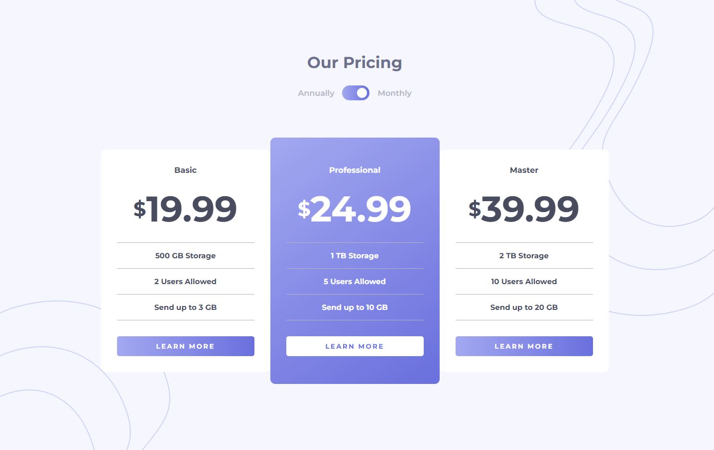

# Frontend Mentor - Pricing component with toggle solution

This is a solution to the [Pricing component with toggle challenge on Frontend Mentor](https://www.frontendmentor.io/challenges/pricing-component-with-toggle-8vPwRMIC). Frontend Mentor challenges help you improve your coding skills by building realistic projects. 

## Table of contents

- [Overview](#overview)
  - [The challenge](#the-challenge)
  - [Screenshot](#screenshot)
  - [Links](#links)
- [My process](#my-process)
  - [Built with](#built-with)
- [Author](#author)

## Overview

### The challenge

Users should be able to:

- View the optimal layout for the component depending on their device's screen size
- Control the toggle with both their mouse/trackpad and their keyboard (arrows right and left)

### Screenshot

### Links

- Solution URL: [https://www.frontendmentor.io/solutions/react-vite-and-styledcomponents-j4fBzqearH](https://www.frontendmentor.io/solutions/react-vite-and-styledcomponents-j4fBzqearH)
- Live Site URL: [https://frontend-mentor-pricing-component-with-toggle-ten.vercel.app/](https://frontend-mentor-pricing-component-with-toggle-ten.vercel.app/)

## My process

### Built with

- Semantic HTML5 markup
- CSS custom properties
- Flexbox
- CSS Grid
- Mobile-first workflow
- [Vite](https://vitejs.dev/guide/)
- [Styled Components](https://styled-components.com/) - For styles

## Author

- Frontend Mentor - [@marianaceci](https://www.frontendmentor.io/profile/marianaceci)
- LinkedIn - [Mariana Schmidt](https://www.linkedin.com/in/marianaceciliaschmidt)
